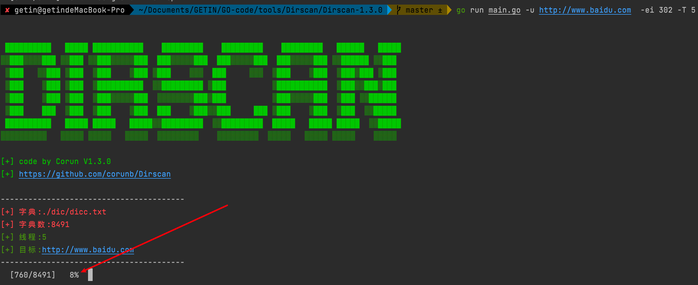
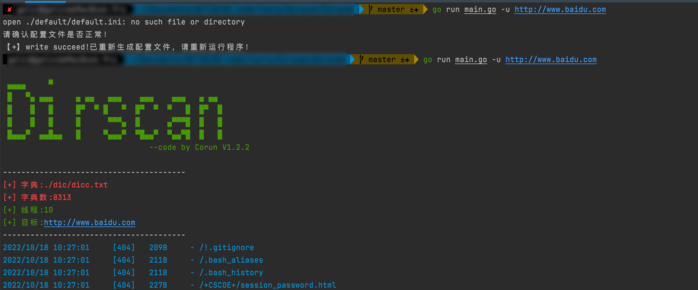

## 0x01 前言

```
Dirscan 是一款由 go 编写的高并发的目录扫描器，现在已经支持基础扫描功能,后续努力实现更多功能；
大佬们勿喷，有什么建议或者 bug 可以提 issues 。
欢迎一起讨论，提供思路或者字典。
```

### Corun项目成员： [getin63](https://github.com/getin63) & [goout2](https://github.com/goout2)   

* 2022.10.21 已实现：

```
Version--> V1.3.0 :
1. 支持并发快速扫描，可设置线程，延迟时间；
2. 过滤状态码；
3. 设置字典；
4. 批量扫描；
5. 结果文件写入，只保存 20x、30x、403 的扫描结果；
6. 302 跳转结果显示；
7. 递归扫描，支持 GET/HEAD ；
8. 结果文件默认为 日期+url 命名；
9. 使用加载配置设置默认参数；
10. 状态码排除；
11. 随机UA头
12. 进度条显示
```

最新支持进度条显示



* 计划实现：

```
1. 设置代理
2. 设置忽略状态码  ✔️
3. 添加爬虫爬取页面url进行递归扫描
4. 进度条显示 ✔️
5. 图形化显示
6. 随机UA头 ✔️
```


## 0x02 编译

```
linux/mac: 
1. 终端翻墙，同步：go mod tidy
2. 一键编译4个版本的二进制文件，编译：make all 

windows: 
1. 终端翻墙，同步：go mod tidy
2. 编译：CGO_ENABLED=0 GOOS=windows GOARCH=amd64 go build -ldflags="-s -w " -trimpath -o Dirscan.exe main.go
```


## 0x03 使用方式

### 3.1 扫描参数

```
  -R string
        指定G->Get扫描还是H->Head扫描 (default "G")
  -T int
        设置线程，默认30 (default 30)
  -ei string
        忽略指定状态码,示例：200,403,404,500或者200-400
  -f string
        指定目录字典 (default "./dic/dicc.txt")
  -i string
        筛选指定状态码,示例：200,403,404,500或者200-400 (default "100-599")
  -o string
        保存扫描结果,默认输出日期+地址
  -r    进行递归扫描
  -t int
        设置延时时间，默认200ms (default 200)
  -u string
        指定url
  -uf string
        指定url列表

```

### 3.2 参数详解

#### GET 扫描:

```
./Dirscan -u http://xxx.xxx.xxx.xxx 
默认以 日期+url 进行结果记录的文件名。
```


#### HEAD 扫描：

```
./Dirscan -u http://xxx.xxx.xxx.xxx -R H
```


#### 筛选状态码：

```
./Dirscan -u http://xxx.xxx.xxx.xxx -i 200,302
筛选状态码可支持单个/多个，和区间筛选，区间可为 -i 200-302
```


#### 递归扫描：

```
./Dirscan -u http://xxx.xxx.xxx.xxx -r -i 200 
默认对状态码200、301、302、403的目录进行递归扫描。
```


#### 线程控制：

```
默认 10 线程，5 秒延迟
./Dirscan -u http://xxx.xxx.xxx.xxx -T 100 -t 5
```


#### 字典选择：

```
./Dirscan -u http://xxx.xxx.xxx.xxx -f ./dic/php.txt
```

		

#### 默认配置加载

```
可更改 ./default/default.ini 文件中的默认配置信息，以改变默认设置。
```


#### 状态码排除

```
使用 -ei 301-401,404 可排除状态码显示。
```


## 0x04 更新记录：

* [+] 2022.10.13 修复：

```
1. 修复递归扫描时，302 与 200 时的字典重复扫描；
```

* [+] 2022.10.18 修复：

```
1. 修复没有默认配置文件时退出并生成默认配置文件；
```




* [+] 2022.10.23 重构并发方式；

  

* [+] 2022.10.24 新增扫描时随机UA头；

* [+] 2022.10.25 新增进度条显示；

  windows,linux测试均可使用。

  

## 0x05 声明：

* 本工具仅用于个人安全研究学习。由于传播、利用本工具而造成的任何直接或者间接的后果及损失，均由使用者本人负责，工具作者不为此承担任何责任。

* 转载请注明来源！！！！
