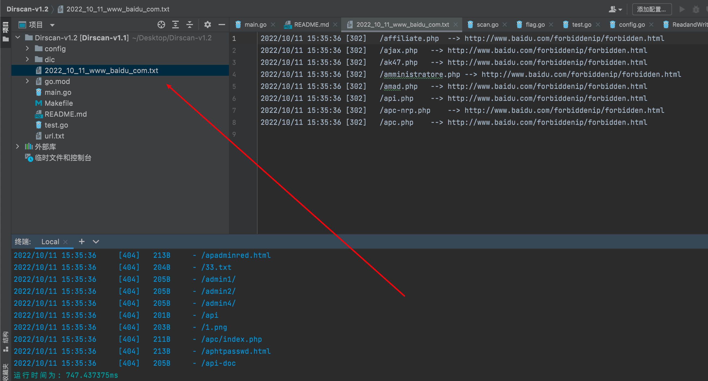
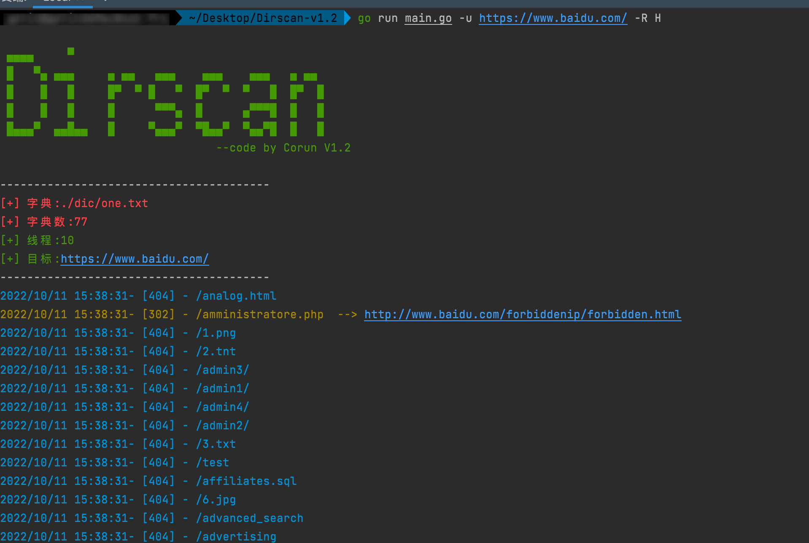
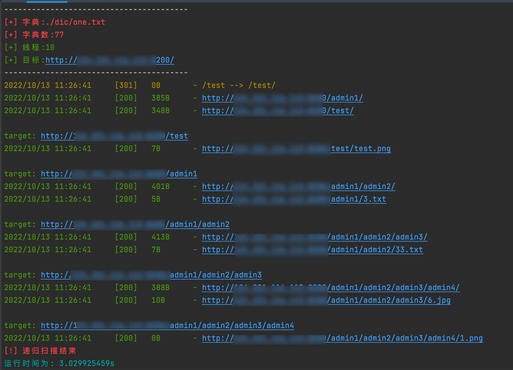
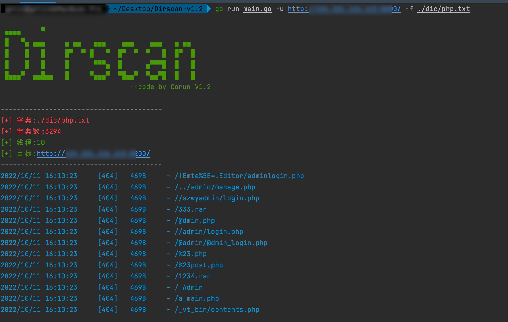
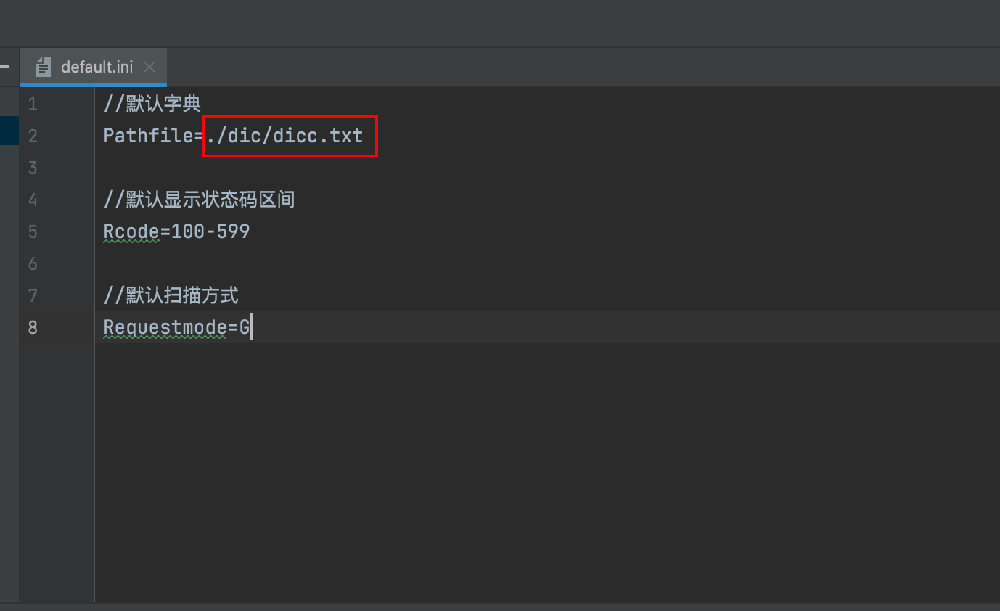
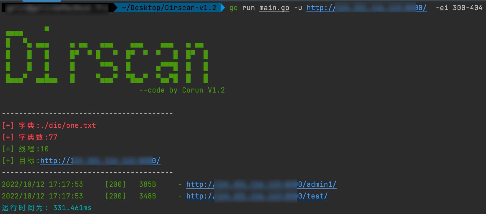

### 0x01 前言：

```
Dirscan是一款由go编写的高并发的目录扫描器，现在已经支持基础扫描功能,后续努力实现更多功能；大佬们勿喷，有什么建议或者bug可以提issues。
```

* 2022.10.13 修复：v1.2.1
```
1，修复递归扫描时，302与200时的字典重复扫描
```

* 2022.10.12 已实现：v1.2
```
1，使用信号量进行并发快速扫描,可设置线程，延迟时间
2，过滤状态码
3，设置字典
4，批量扫描
5，结果文件写入，,只保存20x,30x,403的
6, 302跳转结果显示
7, 递归扫描，支持GET,HEAD
8，结果文件默认为日期+url命名
9, 使用加载配置设置默认参数
10,状态码排除
```
* 以后实现：

  1，设置代理
  ~~2，设置忽略状态码~~
  3，添加爬虫爬取页面url进行递归扫描
  4，进度条显示
  5，图形化显示
  6，随机UA头


### 0x02 编译：

```
linux,mac: 终端进行代理后
同步：go mod tidy
一键编译4个版本的二进制文件
编译：make all 

windows: 终端进行代理后
同步：go mod tidy
编译：CGO_ENABLED=0 GOOS=windows GOARCH=amd64 go build -ldflags="-s -w " -trimpath -o Dirscan.exe main.go
```


### 0x03 使用方式：

#### 			GET扫描:

```
./Dirscan -u http://xxx.xxx.xxx.xxx 
默认以日期+url进行结果记录的文件名
```



#### 			HEAD扫描：

```
./Dirscan -u http://xxx.xxx.xxx.xxx -R H
```



#### 			筛选状态码：

```
./Dirscan -u http://xxx.xxx.xxx.xxx -i 200,302
筛选状态码可支持单个，多个，和区间赛选，区间可为-i 200-302
```


#### 			递归扫描：

```
./Dirscan -u http://xxx.xxx.xxx.xxx -r -i 200 
默认对状态码200,301,302,403的目录进行递归扫描，字典没有/admin1/admin2/admin3/admin4/1.png ，是递归扫描得出。
```



#### 			线程控制：

```
默认10线程，5s延迟
./Dirscan -u http://xxx.xxx.xxx.xxx -T 100 -t 5
```


#### 			字典选择：

```
./Dirscan -u http://xxx.xxx.xxx.xxx -f ./dic/php.txt
```

		

#### 默认配置加载

```
可更改./default/default.ini 文件中的默认配置信息，以改变默认设置。
例如更改默认字典选项
```



#### 状态码排除

```
使用-ei 301-401,404 可排除状态码显示
```




### 0x04 免责申明：

* 请勿未授权爆破扫描
* 项目仅用于学习交流
* 下载进行非法爆破雨我无瓜

 
